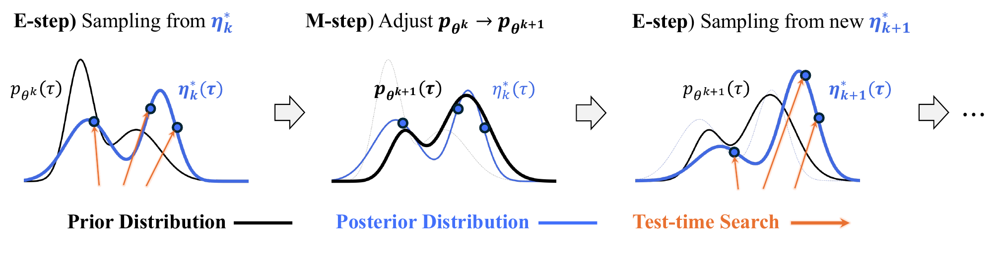

# Diffusion Alignment as Variational Expectation-Maximization
Jaewoo Lee, Minsu Kim, Sanghyeok Choi, Inhyuck Song, Sujin Yun, Hyeongyu Kang, Woocheol Shin, Taeyoung Yun, Kiyoung Om, Jinkyoo Park

[Paper link](https://arxiv.org/abs/2510.00502)


### Abstract
Diffusion alignment aims to optimize diffusion models for the downstream objective. While existing methods based on reinforcement learning or direct backpropagation achieve considerable success in maximizing rewards, they often suffer from
reward over-optimization and mode collapse. We introduce Diffusion Alignment
as Variational Expectation-Maximization (DAV), a framework that formulates
diffusion alignment as an iterative process alternating between two complementary phases: the E-step and the M-step. In the E-step, we employ test-time search
to generate diverse and reward-aligned samples. In the M-step, we refine the diffusion model using samples discovered by the E-step. We demonstrate that DAV
can optimize reward while preserving diversity for both continuous and discrete
tasks: text-to-image synthesis and DNA sequence design.

<p align="center">
  
</p>

## Tasks

| Task  | Directory |
|------|-----------|
| **Text-to-Image Generation**  | [`text-to-image/`](text-to-image/) |
| **DNA Sequence Design**  | [`discrete-sequence/`](discrete-sequence/) |


## Citation

If you find this repository helpful, please cite our work:


```bibtex
@article{lee2025diffusion,
  title={Diffusion Alignment as Variational Expectation-Maximization},
  author={Lee, Jaewoo and Kim, Minsu and Choi, Sanghyeok and Song, Inhyuck and Yun, Sujin and Kang, Hyeongyu and Shin, Woocheol and Yun, Taeyoung and Om, Kiyoung and Park, Jinkyoo},
  journal={arXiv preprint arXiv:2510.00502},
  year={2025}
}
```

