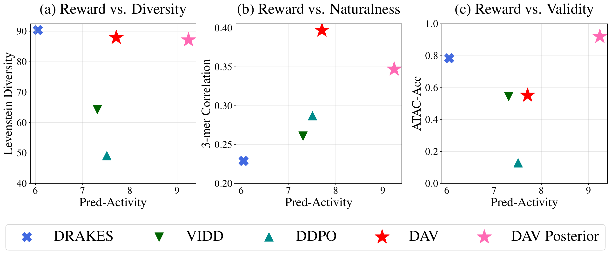

# Diffusion Alignment as Variational Expectation-Maximization (DNA Sequence Design)

This repository is the official codebase of [Diffusion Alignment as Variational Expectation-Maximization (DAV)](https://arxiv.org/abs/2510.00502) for DNA Sequence design. This implementation optimizes [Masked Diffusion Language Model]() pretrained with the dataset in [Gosai et al., 2023](https://www.nature.com/articles/s41586-024-08070-z) for HepG2 activity reward. If you are interested in applying DAV to text-to-image generative models, please refer to [`text-to-image`](../text-to-image/).

<p align="center">
  
</p>

## Installation

```bash
conda create -n dav-dna python=3.9
conda activate dav-dna
pip install -r requirements.txt 
```

## Setup 
```bash
python allmodels/model_load.py
```

This downloads the following artifacts:

| Artifact | Target Path |
| :--- | :--- |
| `DNA_value:v0` | `./artifacts/DNA_value:v0/human_enhancer_diffusion_enformer_7_11_1536_16_ep10_it3500.pt` |
| `DNA_Diffusion:v0` | `./artifacts/DNA_Diffusion:v0/last.ckpt` |
| `DNA_evaluation:v0` | `./artifacts/DNA_evaluation:v0/model.ckpt` |


Download `DRAKES_data.zip` from [DRAKES](https://www.dropbox.com/scl/fi/zi6egfppp0o78gr0tmbb1/DRAKES_data.zip?rlkey=yf7w0pm64tlypwsewqc01wmfq&st=xe8dzn8k&dl=0). Place it in the `discrete-sequence/` root directory, unzip it, and relocate the files as follows:

```bash
# Unzip (extracts to data_and_model/)
unzip DRAKES_data.zip

# ATAC classifier
mkdir -p ./artifacts/ATAC_oracle
cp data_and_model/mdlm/gosai_data/binary_atac_cell_lines.ckpt ./artifacts/ATAC_oracle/

# Reward oracles
mkdir -p ./artifacts/Pred_acc_oracle
cp data_and_model/mdlm/outputs_gosai/lightning_logs/reward_oracle_eval.ckpt ./artifacts/Pred_acc_oracle/
cp data_and_model/mdlm/outputs_gosai/lightning_logs/reward_oracle_ft.ckpt ./artifacts/Pred_acc_oracle/

# Dataset
gunzip data_and_model/mdlm/gosai_data/dataset.csv.gz
mkdir -p ./data
cp data_and_model/mdlm/gosai_data/dataset.csv ./data/

# Clean up
rm -rf data_and_model __MACOSX DRAKES_data.zip
```


## Usage

To reproduce the DNA enhancer generation results, ensure your environment is set up and run:

```
python finetune.py --load_checkpoint_path artifacts/DNA_value:v0/human_enhancer_diffusion_enformer_7_11_1536_16_ep10_it3500.pt \
    --task dna \
    --sample_M 10 \
    --tweedie False \
    --learning_rate 2e-4 \
    --inner_epochs 2 \
    --seed 1 \
    --epochs 200
```

## Acknowledgement

This codebase builds upon the [SVDD](https://github.com/masa-ue/SVDD) implementation and incorporates pretrained artifacts from [DRAKES](https://github.com/ChenyuWang-Monica/DRAKES). We thank the authors for making their code and models publicly available.